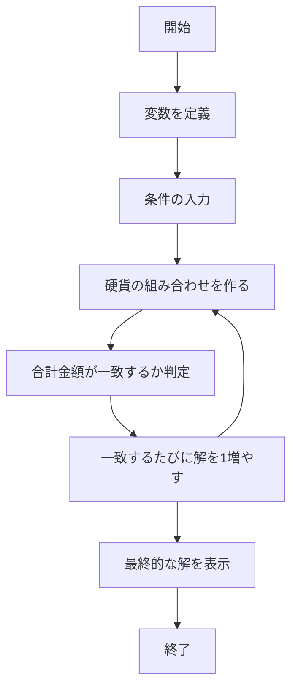

```mermaid
flowchart TD
    A[開始] --> B[変数を定義]
    B --> C[条件の入力]
    C --> D[硬貨の組み合わせを作る]
    D --> E[合計金額が一致するか判定]
    E --> F[一致するたびに解を1増やす]
    F --> D
    F --> G[最終的な解を表示]
    G --> H[終了]
```
