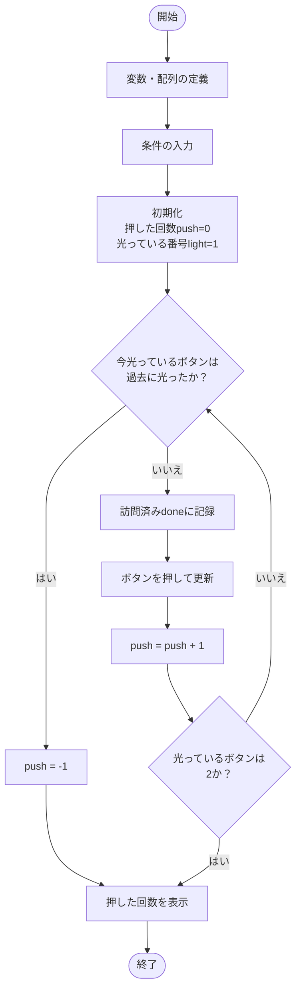

```mermaid
flowchart TD
    A([開始])
    B[変数・配列の定義]
    C[条件の入力]
    D[初期化<br/>押した回数push=0<br/>光っている番号light=1]
    E{今光っているボタンは<br/>過去に光ったか？}
    F[push = -1]
    G[訪問済みdoneに記録]
    H[ボタンを押して更新]
    I[push = push + 1]
    J{光っているボタンは<br/>2か？}
    K[押した回数を表示]
    L([終了])

    A --> B
    B --> C
    C --> D
    D --> E

    E -- はい --> F
    F --> K

    E -- いいえ --> G
    G --> H
    H --> I
    I --> J

    J -- はい --> K
    J -- いいえ --> E

    K --> L
```
