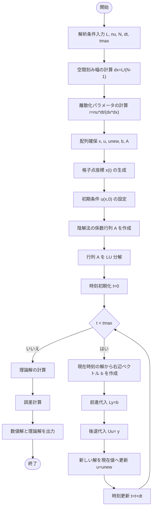

```mermaid
flowchart TD

A([開始])

--> B["解析条件入力 L, nu, N, dt, tmax"]

--> C["空間刻み幅の計算 dx=L/(N-1)"]

--> D["離散化パラメータの計算 r=nu*dt/(dx*dx)"]

--> E["配列確保 x, u, unew, b, A"]

--> F["格子点座標 x(i) の生成"]

--> G["初期条件 u(x,0) の設定"]

--> H["陰解法の係数行列 A を作成"]

--> HH["行列 A を LU 分解"]

--> I["時刻初期化 t=0"]

--> J{"t < tmax"}

J -- いいえ --> X["理論解の計算"]

X --> W["誤差計算"]

W --> Y["数値解と理論解を出力"]

Y --> Z([終了])

J -- はい --> K["現在時刻の解から右辺ベクトル b を作成"]

K --> L["前進代入 Ly=b"]

L --> M["後退代入 Uu= y"]

M --> N["新しい解を現在値へ更新 u=unew"]

N --> O["時刻更新 t=t+dt"]

O --> J
```
