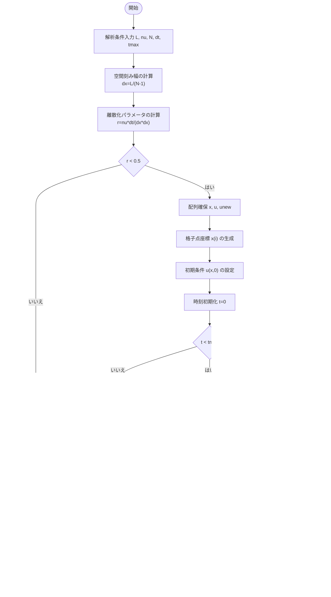

```mermaid
flowchart TD

A([開始])

--> B["解析条件入力 L, nu, N, dt, tmax"]

--> C["空間刻み幅の計算<br>dx=L/(N-1)"]

--> D["離散化パラメータの計算<br>r=nu*dt/(dx*dx)"]

--> R{"r < 0.5"}

R -- いいえ --> S["安定条件を満たさない"]

S --> Z([終了])

R -- はい --> E["配列確保 x, u, unew"]

E --> F["格子点座標 x(i) の生成"]

F --> G["初期条件 u(x,0) の設定"]

G --> H["時刻初期化 t=0"]

H --> I{"t < tmax"}

I -- いいえ --> X["理論解の計算"]

X --> W["誤差計算"]

W --> Y["数値解と理論解を出力"]

Y --> Z([終了])

I -- はい --> J["左端境界条件 u(1)=0"]

J --> K["i=2"]

K --> L{"i <= N-1"}

L -- はい --> M["unew(i)=u(i)+r*(u(i+1)-2*u(i)+u(i-1))"]

M --> N["i=i+1"]

N --> L

L -- いいえ --> O["右端境界条件 unew(N)=unew(N-1)"]

O --> P["u=unew"]

P --> Q["t=t+dt"]

Q --> I
```
